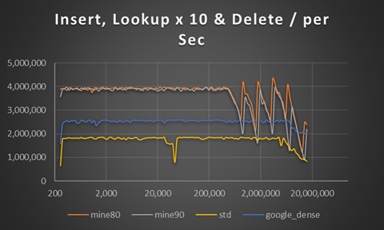
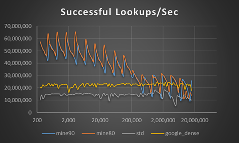
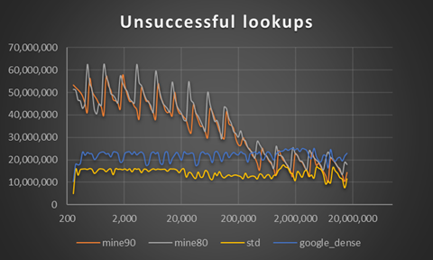
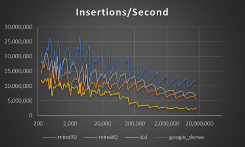

# OpenSourceStuff

This is a repository where I gather small usefull functions of mine that I've decided to realase for free, currently involving DH_memset_32, DH_RingBuffer, DH_HashTable and example code for using raw_input on windows.

### DH_HashTable
DH_HashTable is a fast openadressed robinhood hashtable.

#### RobinHood hashtables as implemented here comes with the following set of characteristics
##### Pros
  * They're very, very fast.
  * They don't have degrading performance after insert and the removing an object.
  * They can be filled to a resonably high load factor without crippling the performance.
  
#### Cons
  * Some things does get slow with higher load factor ie. remove. This might be non-obvious, don't push it too high.
  * Copy from one hashtable to another of smaller size can be quadratic. See the Gotchas in the top of the file how to handle this.
  
DH_HashTable is a hashset, hashmap or multihashmap depending on defines. Ie one key can map to zero, one, or multiple values.
DH_HashTable stores the hashes along with the keys and the values. This is a 4 byte overhead per entry but does significantly speed up the hashtable when the key equevalence function is slow.

DH_HashTable uses a small subset of C++. This means that there are no destructors or constructors nor is there any templates. I have not yet profiled the multimap or the set. The performance is unknown. The multimap saves the key and hash for each value. Zero To Five values per key is about the size I had in mind while developing the multimap, for larger amount of keys you might be better off storing a linked list or dynamic array externally.

To use it just define the mandatory defines stated at the top of the file and include it. No build steps, no nothing. Just include and it'll work. 

Here are some benchmarks. I've used google_benchmark to get them. The google_dense is googles dense_hash_map, std is the msvcs version.
Both of them used their default max_load_factor which is .5 for dense_hash_map and 1 for the std version (I should probably redo this with std at a lower loadfactor but I don't have the time at the moment. mine_80 is DH_HASHTABLE with a loadfactor of 0.80 and mine_90 at 0.90. Both keys and values in this examples are 32 bit integer. I expect to see larger difference with for example strings as keys.

### DH_RingBuffer
DH_RingBuffer is a fast fixed-size threadsafe and lock-free queue.

It can easily be modified to allow for dynamic sizing at the expence of the lock-free-ness. it would _probably_ not be too much of an overhead because it's an edgecase. 

### DH_memset_32
DH_memset_32 is a fast implementation of memset for 4 byte values.
Letting memset accept integer values is totally reasonable, its less limiting and doesn't cost anything.

On my machene my implementation is actually *faster* than the default memset on both clang and msvc (havn't tested on gcc), more than twice as fast in certain ranges and never slower. This is beacuse we don't need to set the final values since we're allways setting whole 4 bytes. Which saves a couple of instructions and reduces branches slightly. Memset is also memory bound so it's not hard to make fast.

**Why not accept 8 byte values as well?**
It probably should but I haven't had the need for one so I havn't written it. I might though.

**Why did you need a fast 4 byte memset?**
I'm currently working on a software rendendered texteditor. If we want to set a block to some color (eg. background) we need to have a fast memset, if that color isn't grayscale it needs to accept 4 byte values.

**PROBABLY NOT GOOD**
It's been a while and I believe on newer computers just using string instructions are faster, dont' fuck up the cache as much etc.

### raw_input_example.cpp
Is just some small example code of how to use raw_input on windows to get left/right -control/-alt/-shift/-enter, listning to keypresses in the background and getting out the unicode characters (without going through WM_UNICODE). I actually think using raw_input results in  code that is slightly cleaner that handeling all WM_CHAR,WM_UNICODE,WM_KEY,WM_SYSKEY ... (and maybe even GetKeyBoardState GetKey GetKeyAsync) etc...  

##Liscense for everything in this repository is:
  This software is dual-licensed to the public domain and under the following
  license: you are granted a perpetual, irrevocable license to copy, modify,
  publish, and distribute this file as you see fit.
  
  
  
##Who are you?
  
  I'm a university student at Chalmers University of Technology in Sweden. 
  
##Why should I trust some collage student that he can write correct code?
 You probably shouldn't at least not if something is depending on it. Verify that the implimentation is correct youself. 
  
